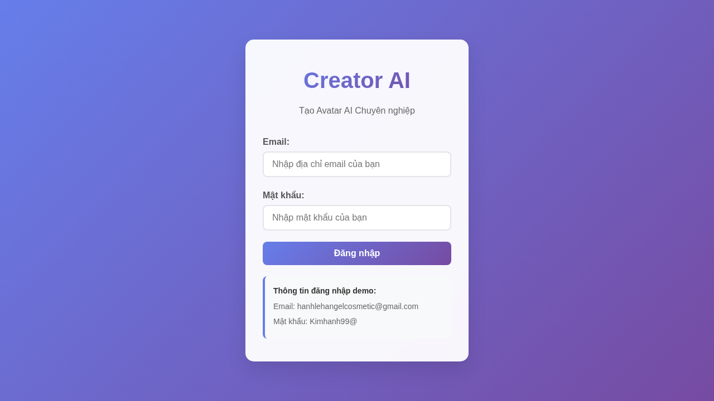
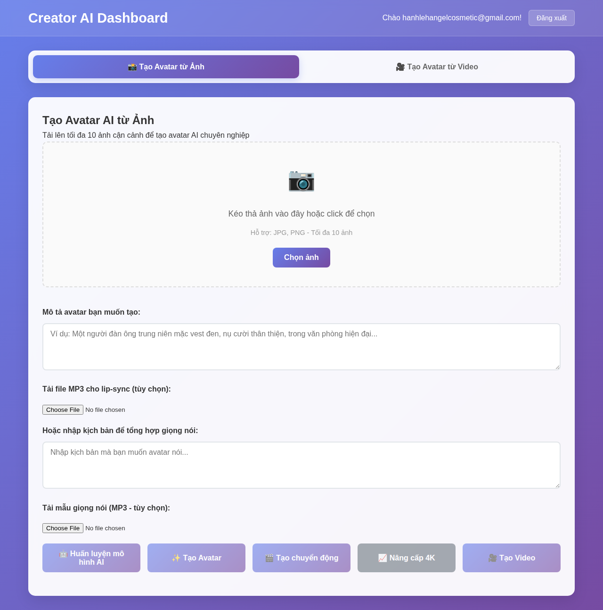
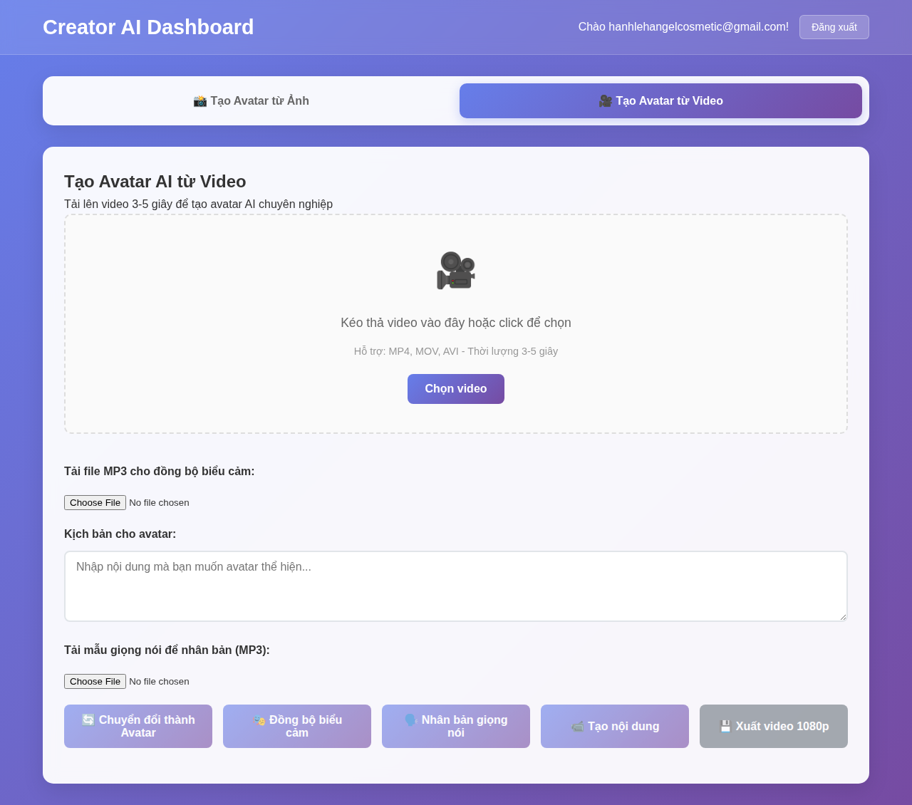

# Creator AI - Comprehensive Avatar Creation System

Creator AI is a professional web application for creating AI-powered avatars from photos and videos. The system provides an intuitive interface with advanced features for avatar generation, animation, and video creation.

## 🚀 Features

### Security & Authentication
- ✅ Secure login system with predefined credentials
- ✅ Session management using Local Storage (24-hour expiration)
- ✅ Protected dashboard access and logout functionality
- ✅ Route protection for authenticated pages

### Photo-based Avatar Creation
- ✅ Upload up to 10 close-up images (JPG/PNG) with drag & drop
- ✅ AI model training simulation with progress indicators
- ✅ Generate 4 AI-powered avatars from text prompts
- ✅ Add motion to static images (5-10 second videos)
- ✅ Upscale images to 4K resolution
- ✅ Create videos with audio synchronization (MP3 lip-sync)
- ✅ Text script input with voice synthesis
- ✅ Export videos at 1080p quality

### Video-based Avatar Creation
- ✅ Upload 3-5 second video clips (MP4/MOV/AVI)
- ✅ Convert videos to avatars with progress tracking
- ✅ Expression synchronization with MP3 files
- ✅ Voice cloning functionality
- ✅ Text-based content creation with speech synthesis
- ✅ Export videos at 1080p quality

### User Experience
- ✅ Purple gradient-themed, tab-based interface
- ✅ Responsive design (desktop, tablet, mobile)
- ✅ Real-time progress indicators
- ✅ File preview grids with removal functionality
- ✅ Success/error messaging system
- ✅ Vietnamese language interface
- ✅ Accessibility with HTML5 semantic structure

### System Features
- ✅ File type and size validation
- ✅ Progress tracking for all AI operations
- ✅ Media preview functionality
- ✅ Workflow state management
- ✅ Error handling with user feedback
- ✅ Local storage data persistence

## 🛠️ Technical Stack

- **Frontend**: HTML5, CSS3, JavaScript ES6+
- **Styling**: CSS Grid, Flexbox, CSS Animations
- **Storage**: Local Storage for session and data management
- **Validation**: Comprehensive file and input validation
- **Responsive**: Mobile-first responsive design

## 🔐 Login Credentials

For demonstration purposes, use these credentials:
- **Email**: hanhlehangelcosmetic@gmail.com
- **Password**: Kimhanh99@

## 📁 Project Structure

```
creator-ai/
├── index.html              # Login page
├── dashboard.html           # Main application dashboard
├── css/
│   └── styles.css          # Complete styling with purple theme
├── js/
│   ├── auth.js             # Authentication management
│   ├── dashboard.js        # Dashboard controller
│   ├── photo-mode.js       # Photo-based avatar creation
│   ├── video-mode.js       # Video-based avatar creation
│   └── utils.js            # Utility functions
├── screenshots/            # UI screenshots
├── test.sh                 # Comprehensive test script
└── README.md              # This file
```

## 🧪 Testing

Run the comprehensive test script to validate the system:

```bash
./test.sh
```

The test script validates:
- ✅ File structure completeness
- ✅ HTML semantic validity
- ✅ CSS class availability
- ✅ JavaScript function presence
- ✅ Security features
- ✅ Responsive design
- ✅ Feature completeness
- ✅ Error handling

**Test Results**: 79/79 tests passing ✅

## 📱 Screenshots

### Login Screen


### Dashboard - Photo Mode


### Dashboard - Video Mode


### Mobile Responsive


## 🚀 Getting Started

1. **Clone the repository**:
   ```bash
   git clone https://github.com/hanh-io-company-limited/creator-ai.git
   cd creator-ai
   ```

2. **Serve the application**:
   ```bash
   # Using Python
   python3 -m http.server 8080
   
   # Using Node.js
   npx http-server -p 8080
   
   # Using PHP
   php -S localhost:8080
   ```

3. **Open browser**: Navigate to `http://localhost:8080`

4. **Login**: Use the demo credentials provided

5. **Start creating**: Choose between photo or video mode to create avatars

## 🎯 Usage Guide

### Photo Mode Workflow
1. Upload 1-10 close-up photos (JPG/PNG)
2. Click "Huấn luyện mô hình AI" to train the model
3. Enter description for desired avatar
4. Click "Tạo Avatar" to generate 4 AI photos
5. Add motion with "Tạo chuyển động"
6. Optionally upscale to 4K
7. Create video with audio/script input

### Video Mode Workflow
1. Upload 3-5 second video (MP4/MOV/AVI)
2. Click "Chuyển đổi thành Avatar"
3. Add MP3 for expression sync or enter script
4. Use voice cloning if desired
5. Create content and export 1080p video

## ⌨️ Keyboard Shortcuts

- `Ctrl + 1`: Switch to Photo Mode
- `Ctrl + 2`: Switch to Video Mode
- `Ctrl + R`: Reset current tab
- `Ctrl + Shift + R`: Reset all data
- `F1`: Show keyboard shortcuts

## 🔧 Development Console

Access development commands in browser console:
```javascript
// Available commands
dashboardCommands.reset()       // Reset current tab
dashboardCommands.resetAll()    // Reset all data
dashboardCommands.export()      // Export all data
dashboardCommands.shortcuts()   // Show shortcuts
dashboardCommands.performance() // Performance info
dashboardCommands.switchTab('photo') // Switch tabs
```

## 🌐 Browser Compatibility

- ✅ Chrome 80+
- ✅ Firefox 75+
- ✅ Safari 13+
- ✅ Edge 80+

## 📝 License

This project is licensed under the Creative Commons Attribution-NoDerivatives 4.0 International (CC BY-ND 4.0) License.

## 🤝 Contributing

This is a demonstration project. For production use, consider adding:
- Real AI model integration
- Cloud storage support
- User account management
- Payment processing
- Advanced video editing
- API backend integration

## 📞 Support

For issues or questions about this demonstration, please open an issue on GitHub.

---

**Creator AI** - Professional Avatar Creation Made Simple 🎨✨